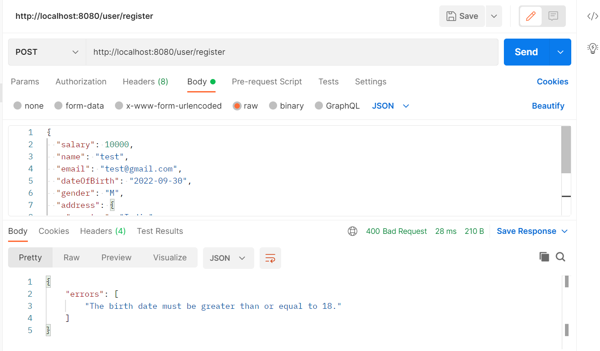
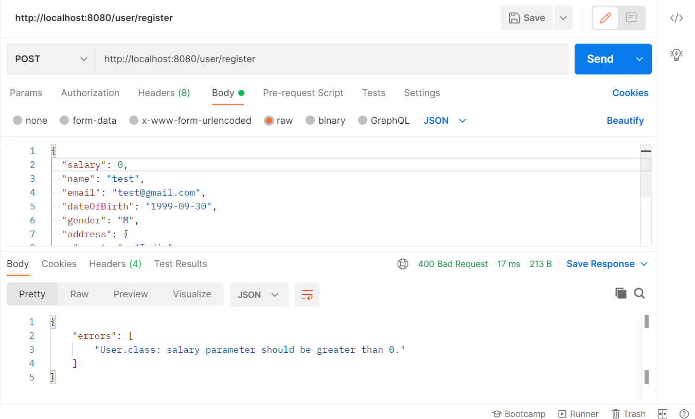

# Custom Validator Assignment

Endpoints for the application:

* Create a user: 
  * POST /user/register
  * Body:
    {
      "salary": 0,
      "name": "string",
      "email": "string",
      "dateOfBirth": "2022-09-28",
      "gender": "string",
      "address": {
           "country": "string",
           "city": "string",
           "zipCode": "string",
           "street": "string",
           "state": "string"
       }
      }
* Retrieve a user by id:
  * GET /user/{id}

* Scrrenshots:
* When wrong date of birth is passed:
  * 
* When salary passed is not greater then 0:
  * 

